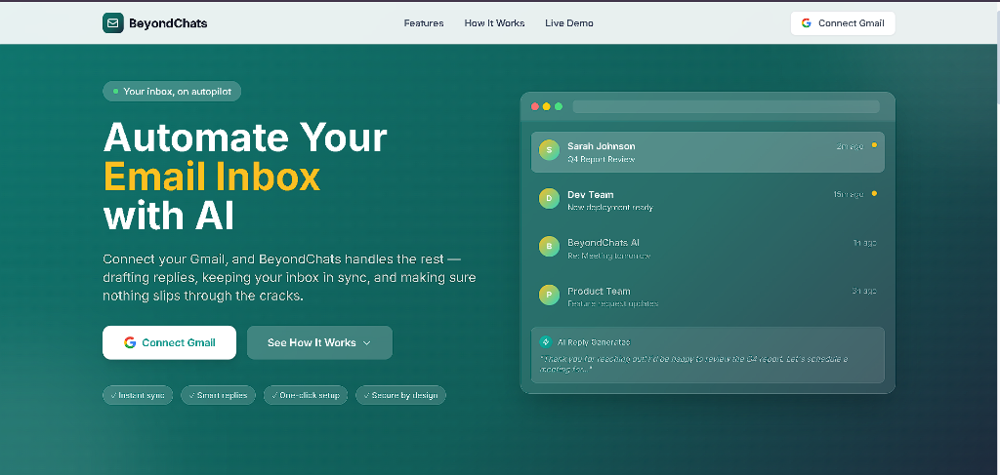
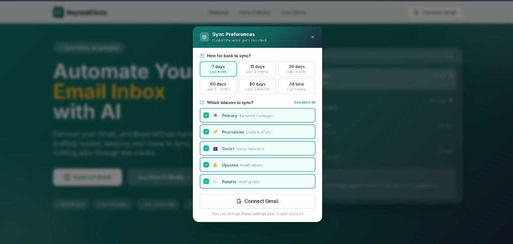
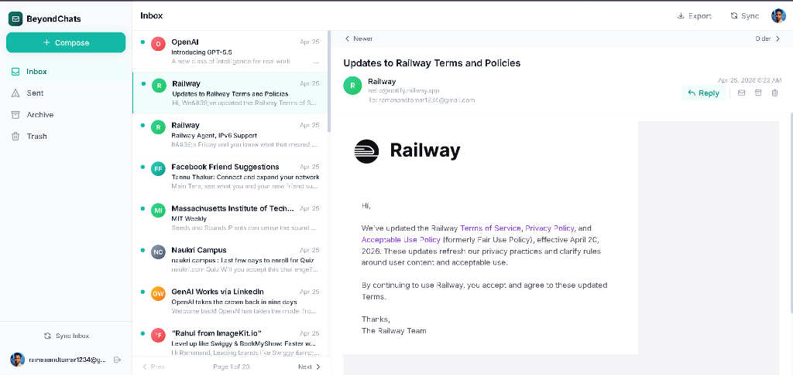
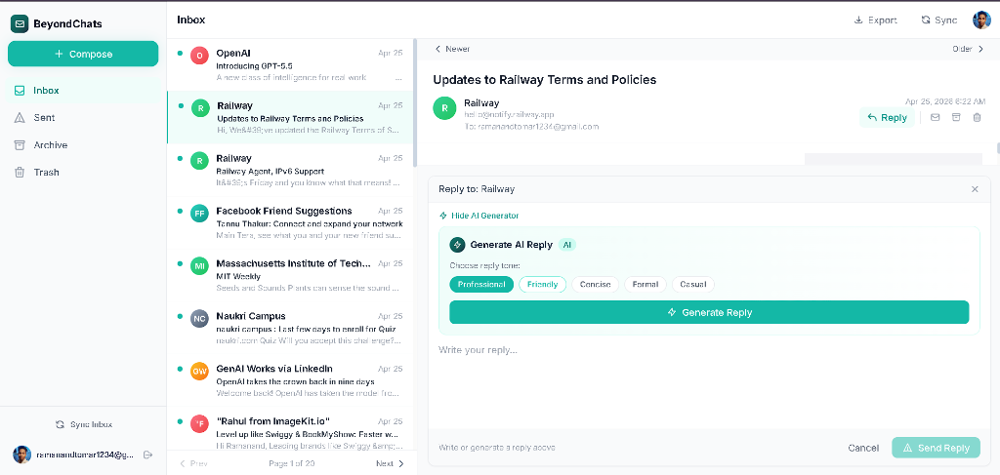

<div align="center">

# ✉️ BeyondChats — AI-Powered Email Automation & Inbox Assistant

[](https://nodejs.org/)
[](https://expressjs.com/)
[](https://react.dev/)
[](https://vitejs.dev/)
[](https://tailwindcss.com/)
[](https://www.mongodb.com/)
[](https://ai.google.dev/)
[](https://socket.io/)

**An intelligent, full-stack email automation platform that connects seamlessly with Gmail, leverages Google Gemini AI to draft context-aware replies, and delivers real-time inbox synchronization.**

### 🌐 Live Application
👉 **[https://email-automation-rose.vercel.app/](https://email-automation-rose.vercel.app/)**

[🚀 Launch Live App](https://email-automation-rose.vercel.app/) • [Backend API](/api/gmail) • [Privacy Policy](https://email-automation-rose.vercel.app/privacy)

</div>

---

## 📌 Overview

**BeyondChats** puts your Gmail inbox on autopilot. Try out the live application at **[https://email-automation-rose.vercel.app/](https://email-automation-rose.vercel.app/)**. It pairs secure **Google OAuth 2.0** authentication with real-time webhooks (Google Cloud Pub/Sub & WebSockets) and **Google Gemini AI** to automate email workflows. Users can sync their inboxes, filter by customizable timeframes and categories, read email threads, and generate human-like contextual responses with a single click.

---

## ✨ Key Features

- **🔐 One-Click Google OAuth 2.0 Authentication**  
  Secure authentication adhering to Google API Services User Data Policies (Limited Use requirements). No stored passwords.

- **🤖 AI Reply Assistant (Google Gemini API)**  
  Draft intelligent, context-aware responses instantly based on the full email thread. Includes customizable tone options:
  - 👔 *Professional*
  - 🤝 *Friendly*
  - ⚡ *Concise*
  - 📝 *Formal*
  - ☕ *Casual*

- **⚙️ Custom Sync Preferences**  
  Select sync time ranges (**7 days**, **15 days**, **30 days**, **60 days**, **90 days**, or **All time**) and choose target inbox categories (**Primary**, **Promotions**, **Social**, **Updates**, **Forums**).

- **🔄 Real-Time Push Notifications & Synchronization**  
  Integrates Google Cloud Pub/Sub notifications with Socket.io to push incoming emails and updates to the user interface instantly without manual refresh.

- **📬 Complete Email Inbox Management**  
  Full-featured dashboard with multi-folder navigation (**Inbox**, **Sent**, **Archive**, **Trash**), rich HTML email rendering, thread timeline, search filtering, pagination, label tagging, and email export capability.

---

## 📸 Application Screenshots

### 1. 🚀 Hero & Landing Page
> Clean, high-converting interface welcoming users to connect their Gmail account and explore features.


---

### 2. ⚙️ Sync Preferences Setup
> Granular control over historical email import duration and category filtering before initiating sync.


---

### 3. 📥 Dashboard Inbox & Email Reader View
> Modern split-pane dashboard displaying organized email threads, rich HTML viewer, and instant action toolbar.


---

### 4. 🪄 AI Reply Generator Modal
> Contextual AI response drafting powered by Google Gemini with selectable tones and direct-send capabilities.


---

## 🛠️ Tech Stack & Architecture

### **Frontend**
- **Framework:** React 18 + Vite
- **Styling:** Tailwind CSS + Lucide Icons
- **Real-Time Client:** Socket.io Client
- **State & HTTP:** React Context API + Axios
- **Deployment:** Vercel / Netlify

### **Backend**
- **Runtime:** Node.js (v18+)
- **Web Framework:** Express 5
- **Database:** MongoDB (Mongoose ORM)
- **Real-Time Server:** Socket.io
- **Integrations:** `googleapis` (Gmail API), Google Cloud Pub/Sub
- **AI SDK:** `@google/genai` (Google Gemini AI API)

---

## 📁 Repository Structure

```
email-automation/
├── assets/
│   └── screenshots/          # Application screenshot assets
│       ├── landing-page.png
│       ├── sync-preferences.png
│       ├── inbox-view.png
│       └── ai-reply-generator.png
├── src/                      # Backend Node.js / Express Source
│   ├── config/               # Database & service configurations
│   ├── controllers/          # Route controller handlers
│   ├── models/               # Mongoose DB Schemas (User, Email)
│   ├── routes/               # Express API endpoints (auth, gmail, ai)
│   └── services/             # Core business logic (Gmail API, Gemini AI, Socket, OAuth)
├── frontend/                 # Frontend React + Vite Source
│   ├── public/               # Static assets & SVG icons
│   └── src/
│       ├── components/       # UI, Landing, Email & Layout components
│       ├── context/          # React Context providers (Auth, Email)
│       ├── hooks/            # Custom React hooks
│       ├── pages/            # Page views (Home, Inbox, OAuth Callback)
│       └── services/         # API integration layer (Axios API calls)
├── .env.example              # Environment variable template
├── index.js                  # Backend application entry point
├── package.json              # Backend dependencies & scripts
└── README.md                 # Project documentation
```

---

## 🚀 Quick Start & Installation Guide

### Prerequisites
Make sure you have the following installed / configured:
- [Node.js](https://nodejs.org/) (v18 or higher)
- [MongoDB](https://www.mongodb.com/) (Local instance or MongoDB Atlas URI)
- [Google Cloud Console Project](https://console.cloud.google.com/) with **Gmail API** enabled & **OAuth 2.0 Credentials**
- [Google Gemini API Key](https://aistudio.google.com/)

---

### Step 1: Clone the Repository
```bash
git clone https://github.com/Ramanand-tomar/email-automation.git
cd email-automation
```

### Step 2: Configure Environment Variables
Create a `.env` file in the root directory (or copy from `.env.example`):

```bash
cp .env.example .env
```

Fill in your configuration details:
```env
# Server Configuration
PORT=5000
FRONTEND_URL=http://localhost:3000

# Database
MONGO_URI=mongodb+srv://<username>:<password>@cluster.mongodb.net/email-automation

# Google OAuth 2.0 Credentials
GOOGLE_CLIENT_ID=your_client_id.apps.googleusercontent.com
GOOGLE_CLIENT_SECRET=your_client_secret
GOOGLE_REDIRECT_URI=http://localhost:5000/api/gmail/oauth2callback

# Google Cloud Pub/Sub Topic
GOOGLE_PUBSUB_TOPIC=projects/your-project-id/topics/gmail-notifications

# Google Gemini AI API Key
GEMINI_API_KEY=your_gemini_api_key
```

---

### Step 3: Install Dependencies

#### Install Backend Dependencies:
```bash
npm install
```

#### Install Frontend Dependencies:
```bash
cd frontend
npm install
cd ..
```

---

### Step 4: Run the Development Servers

#### Start Backend Server:
```bash
# In the root directory
npm run dev
# Server will start on http://localhost:5000
```

#### Start Frontend Application:
```bash
# In another terminal window inside /frontend
cd frontend
npm run dev
# Frontend will start on http://localhost:3000
```

Open `http://localhost:3000` in your browser to view BeyondChats.

---

## 🔑 Google OAuth & Service Setup

1. **Google Cloud Credentials**:
   - Go to [Google Cloud Console Credentials](https://console.cloud.google.com/apis/credentials).
   - Create an **OAuth 2.0 Client ID** (Application type: Web Application).
   - Add Authorized Redirect URI: `http://localhost:5000/api/gmail/oauth2callback`.
   - Enable scopes: `gmail.readonly`, `gmail.send`, `gmail.modify`, `userinfo.profile`, `userinfo.email`.

2. **Gemini API Key**:
   - Obtain an API key from [Google AI Studio](https://aistudio.google.com/).
   - Add the key to `GEMINI_API_KEY` in your `.env`.

---

## 📡 API Endpoint Summary

| Method | Endpoint | Description |
| :--- | :--- | :--- |
| `GET` | `/health` | Server health check endpoint |
| `GET` | `/privacy` | Serves Privacy Policy document |
| `GET` | `/api/gmail/auth` | Initiates Google OAuth 2.0 login redirect |
| `GET` | `/api/gmail/oauth2callback` | OAuth 2.0 redirect callback handler |
| `GET` | `/api/gmail/user` | Fetches authenticated user profile info |
| `GET` | `/api/gmail/messages` | Retrieves paginated emails with filters |
| `POST` | `/api/gmail/sync` | Triggers manual or custom preference sync |
| `POST` | `/api/ai/generate-reply` | Generates Gemini AI email reply draft |
| `POST` | `/api/gmail/send` | Sends email / reply thread via Gmail API |
| `POST` | `/api/gmail/webhook` | Receives Pub/Sub push notification events |

---

## 📄 Privacy & Compliance

BeyondChats strictly complies with the **Google API Services User Data Policy** (including Limited Use requirements). User data and email bodies are fetched exclusively to provide email management and AI reply suggestions, and are never shared or sold.

---

## 🤝 Contributing

Contributions, issues, and feature requests are welcome!  
Feel free to check the [issues page](https://github.com/Ramanand-tomar/email-automation/issues).

---

## 📜 License

This project is licensed under the [ISC License](LICENSE).

---

<div align="center">
  <sub>Built with ❤️ by <strong>BeyondChats Team</strong></sub>
</div>
